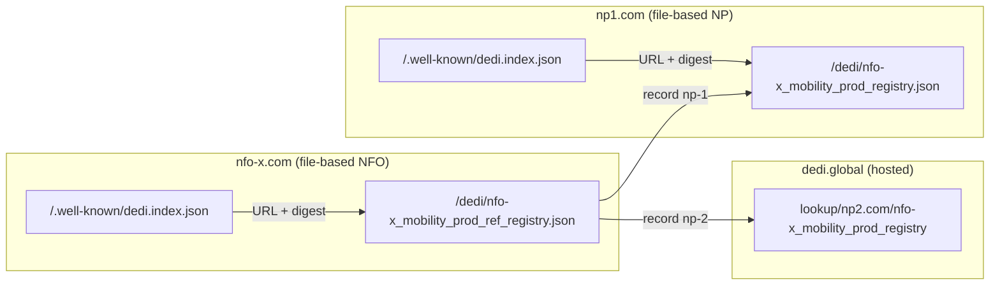

# Worked example

The following are example files for a mobility network operated by an NFO (`nfo-x.com`) with two NPs: `np1.com` (on the [file-based path](file-based.md)) and `np2.com` (on the [hosted path](hosted.md), referenced via its dedi.global lookup URL).



### DeDi index file of the NFO

Hosted at `https://nfo-x.com/.well-known/dedi.index.json`:

```json
{
  "dedi_version": "0.1",
  "type": "dedi-manifest",
  "domain": "nfo-x.com",
  "name": "NFO-X",

  "keys": [
    { "kid": "key-1", "kty": "OKP", "crv": "Ed25519", "x": "j3bN3KHtT_LDVHLBySF0eZ59wn51gwdLg_2v6lcb874" }
  ],

  "updated_at": "2026-07-08T10:00:00Z",
  "next_update": "2026-07-15T10:00:00Z",

  "files": [
    {
      "registry": "nfo-x_mobility_prod_ref_registry",
      "url": "https://nfo-x.com/dedi/nfo-x_mobility_prod_ref_registry.json",
      "digest": "sha-256:59563cf66b442a61b2ee5bee6d306b23668266e9b5ce5d888f65bf14d28aa589",
      "schema": "https://raw.githubusercontent.com/LF-Decentralized-Trust-labs/decentralized-directory-protocol/refs/heads/main/schemas/beckn_subscriber_reference.json"
    }
  ],

  "proof": {
    "verification_method": "key-1", "canonicalization": "JCS", "jws": "eyJ..."
  }
}
```

### The NFO's reference registry

Hosted at `https://nfo-x.com/dedi/nfo-x_mobility_prod_ref_registry.json`:

```json
{
  "dedi_version": "0.1",
  "type": "dedi-file",
  "source_url": "https://nfo-x.com/dedi/nfo-x_mobility_prod_ref_registry.json",
  "next_update": "2026-07-15T10:00:00Z",

  "publisher": {
    "domain": "nfo-x.com",
    "key": {
      "kid": "key-1", "kty": "OKP", "crv": "Ed25519",
      "x": "j3bN3KHtT_LDVHLBySF0eZ59wn51gwdLg_2v6lcb874"
    }
  },

  "namespace": "nfo-x.com",
  "registry": {
    "name": "nfo-x_mobility_prod_ref_registry",
    "schema": "https://raw.githubusercontent.com/LF-Decentralized-Trust-labs/decentralized-directory-protocol/refs/heads/main/schemas/beckn_subscriber_reference.json",
    "state": "live",
    "updated_at": "2026-07-08T10:00:00Z"
  },

  "records": [
    {
      "record_name": "np-1",
      "details": {
        "url": "https://np1.com/dedi/nfo-x_mobility_prod_registry",
        "type": "Registry",
        "subscriber_id": "np1.com"
      }
    },
    {
      "record_name": "np-2",
      "details": {
        "url": "https://api.dedi.global/dedi/lookup/np2.com/nfo-x_mobility_prod_registry",
        "type": "Registry",
        "subscriber_id": "np2.com"
      }
    }
  ],

  "proof": {
    "verification_method": "key-1",
    "canonicalization": "JCS",
    "jws": "eyJhbGciOiJFZERTQSIsImI2NCI6ZmFsc2UsImNyaXQiOlsiYjY0Il19..<detached-signature>"
  }
}
```

### DeDi index file of NP1

Hosted at `https://np1.com/.well-known/dedi.index.json`:

```json
{
  "dedi_version": "0.1",
  "type": "dedi-manifest",
  "domain": "np1.com",
  "name": "Network Participant 1",

  "keys": [
    { "kid": "key-1", "kty": "OKP", "crv": "Ed25519", "x": "m0Wu77LVm7YRsF9Xus4YWqDjrE9zWDPtFgkytdbIMCE" }
  ],

  "updated_at": "2026-07-08T10:00:00Z",
  "next_update": "2026-07-15T10:00:00Z",

  "files": [
    {
      "registry": "nfo-x_mobility_prod_registry",
      "url": "https://np1.com/dedi/nfo-x_mobility_prod_registry.json",
      "digest": "sha-256:c54ee7a794bdb3533a3b7d2b429851183d4bb99b8d91a494b4e917b779457334",
      "schema": "https://raw.githubusercontent.com/LF-Decentralized-Trust-labs/decentralized-directory-protocol/refs/heads/main/schemas/beckn_subscriber.json"
    }
  ],

  "proof": {
    "verification_method": "key-1", "canonicalization": "JCS", "jws": "eyJ..."
  }
}
```

### NP1's registry file

Hosted at `https://np1.com/dedi/nfo-x_mobility_prod_registry.json`:

```json
{
  "dedi_version": "0.1",
  "type": "dedi-file",
  "source_url": "https://np1.com/dedi/nfo-x_mobility_prod_registry.json",
  "next_update": "2026-07-15T10:00:00Z",
  "publisher": {
    "domain": "np1.com",
    "key": {
      "kid": "key-1",
      "kty": "OKP",
      "crv": "Ed25519",
      "x": "m0Wu77LVm7YRsF9Xus4YWqDjrE9zWDPtFgkytdbIMCE"
    }
  },
  "namespace": "np1.com",
  "registry": {
    "name": "nfo-x_mobility_prod_registry",
    "schema": "https://raw.githubusercontent.com/LF-Decentralized-Trust-labs/decentralized-directory-protocol/refs/heads/main/schemas/beckn_subscriber.json",
    "state": "live",
    "updated_at": "2026-07-08T10:00:00Z"
  },
  "records": [
    {
      "record_name": "bap-record",
      "details": {
        "subscriber_id": "np1.com",
        "url": "https://np1.com/beckn/bap/receiver/",
        "type": "BAP",
        "countries": [
          "IDN"
        ],
        "signing_public_key": "4FyXHFd2DZpSlmjN/GybS2w1SO3mFRSqQjCGrbTxoJM="
      }
    }
  ],
  "proof": {
    "verification_method": "key-1",
    "canonicalization": "JCS",
    "jws": "eyJhbGciOiJFZERTQSIsImI2NCI6ZmFsc2UsImNyaXQiOlsiYjY0Il19..<detached-signature>"
  }
}
```

### NP2's hosted record on dedi.global

NP2 is on the hosted path, so its registry lives on dedi.global and is retrieved via the lookup API at `https://api.dedi.global/dedi/lookup/np2.com/nfo-x_mobility_prod_registry`. The response below is abridged — the embedded Beckn Subscriber schema (including the full country-code enum) is truncated for readability:

```json
{
  "message": "Resource retrieved successfully",
  "data": {
    "namespace": "np2.com",
    "namespace_id": "did:web:did.cord.network:<namespace-did>",
    "registry_id": "<registry-id>",
    "registry_name": "nfo-x_mobility_prod_registry",
    "record_id": "<record-id>",
    "record_name": "np2-bap",
    "description": "np2-bap",
    "digest": "0x<sha-256-digest>",
    "schema": {
      "type": "object",
      "title": "Beckn Subscriber",
      "...": "full Beckn Subscriber schema omitted for brevity"
    },
    "version_count": 3,
    "version": "0x<version-hash>",
    "details": {
      "url": "https://api.np2.com/beckn/onix/bap/receiver",
      "type": "BAP",
      "countries": [
        "NLD"
      ],
      "subscriber_id": "np2.com",
      "encr_public_key": "<encryption-public-key>",
      "signing_public_key": "<signing-public-key>"
    },
    "meta": {},
    "genesis": "2026-08-06T08:59:50.939Z",
    "created_at": "2026-08-07T06:56:59.756Z",
    "updated_at": "2026-08-07T06:56:59.756Z",
    "created_by": "did:web:did.cord.network:<creator-did>",
    "state": "live",
    "ttl": 600,
    "proof": {
      "type": "DediRecordProof2026",
      "namespace_did": "did:web:did.cord.network:<namespace-did>",
      "registry_identifier": "<registry-id>",
      "record_identifier": "<record-id>",
      "creator_did": "did:web:did.cord.network:<creator-did>",
      "digest": "0x<sha-256-digest>",
      "network_genesis": "0x<network-genesis-hash>"
    }
  }
}
```
